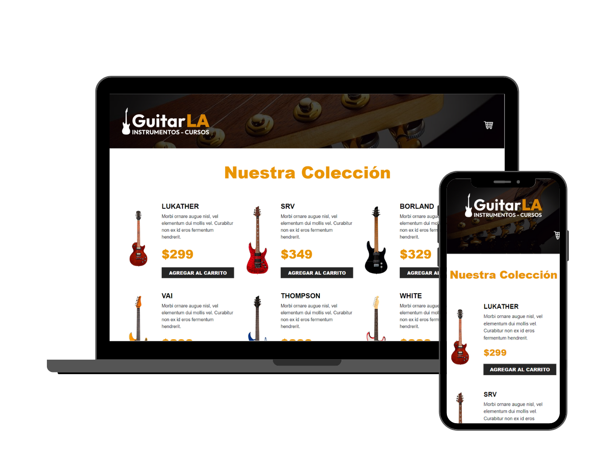

# 🎸 GuitarLA

## 📖 Project Description
GuitarLA is an ecommerce platform specializing in the sale of guitars. The project includes a fully functional shopping cart that allows users to add products, modify quantities, and view the total price of their purchase.

## 🛠 Technologies Used
 

## 📚 What I Learned
During the development of GuitarLA, I learned and applied the fundamentals of React, including:
- **Components**: Creating and using reusable components.
- **Events**: Handling events in React to interact with the user.
- **State**: Managing the application's state, particularly in the context of a shopping cart, allowing real-time updates of quantities and prices.

## 📫 Contact

 
 
 